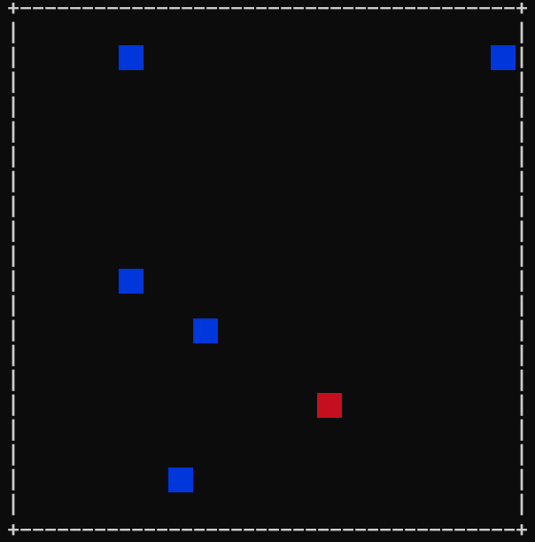

# 方塊逃亡記  

## 簡介

為了躲避大魔王紅色方塊，擁有三顆無敵星星的藍色方塊上演了一場驚心動魄的逃亡記，
情急之下，藍色方塊拿出了冷凍噴霧朝紅色方塊噴灑，並成功冰凍住所有的紅色方塊，
然而，危機仍然存在，被冰凍住的紅色方塊仍四散在地圖各處，
身為玩家的你必須透過鍵盤操控藍色方塊，避免其不小心撞上紅色方塊，
若是不小心撞到紅色方塊，藍色方塊就會被紅色方塊攻擊而死，並被扣一顆無敵星星，
但直到無敵星星被扣完前，藍色方塊都會回到重生點，並獲得重生的機會，趕快一起來幫助
藍色方塊躲避大魔王紅色方塊的攻擊吧

## 作者

[Robert335247](https://github.com/robert335247)

## 預覽圖

